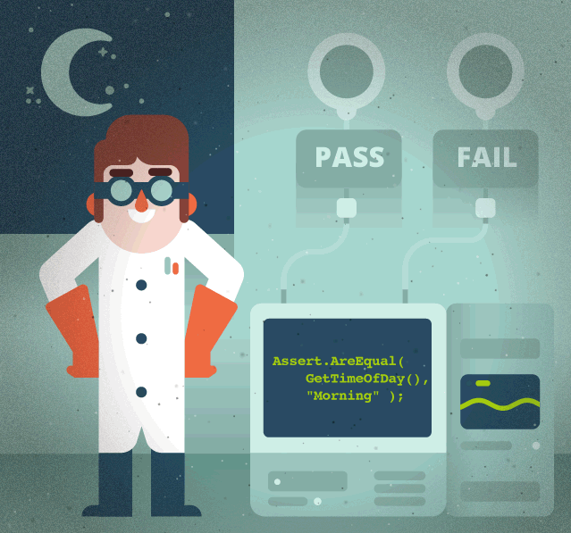

<p align="center"> 
        

 

 ### *Welcome to my GitHub profile!* 

### Here I share my automated tests and other useful things :rocket:

             
 

## ✨ **About Me**

 I am an experienced Software QA Engineer with strong test automation skills. Worked with various test automation tools.
 
 

<p align="right"> 
        

 
- 👨‍💼 &nbsp;5+ years Test Automation experience
- 👨🏼‍💻 &nbsp;Tech Geek, always ready to learn new Technologies/Frameworks/Languages
- 🔭 &nbsp;I’m currently working on new collection of automated tests 
- 🌱 &nbsp;I’m currently learning and practicing TypeScript
- 🗂️ Some of my test collections are available in <a rel="me" href="https://github.com/Sanzhanov?tab=repositories">Alex's repositories</a>
- 💬 &nbsp;Ask me about anything related to QA Automation
- 🏠 &nbsp;Live in Boston, US
- 📫 &nbsp;How to reach me: <a rel="me" href="https://www.linkedin.com/in/sanzhanov/">Alex Sanzhanov</a> or sanzhanov21@gmail.com

             
 

<h1 align="center">Hi 👋 I'm Erdem OZCAN</h1>
<h3 align="center"> Software Test Engineer (QA)</h3>
<h3 align="center">"Passionate about Quality"</h3>

                   

- 🔭 I’m currently working on **a UI Testing Project**

- 🌱 I’m currently learning **Mobile Testing**

- 💬 Ask me about **Java, Selenium**
- 🥅 2023 Goals: Get more experience in Testing

- 📫 How to reach me **eozcan.uk@gmail.com**

<h3 align="left">Connect with me:</h3>

<h3 align="left">Languages and Tools:</h3>

      

<h3 align="left" dir="auto"><a id="user-content-work-places" class="anchor" aria-hidden="true" href="#work-places"><svg class="octicon octicon-link" viewBox="0 0 16 16" version="1.1" width="16" height="16" aria-hidden="true"><path fill-rule="evenodd" d="M7.775 3.275a.75.75 0 001.06 1.06l1.25-1.25a2 2 0 112.83 2.83l-2.5 2.5a2 2 0 01-2.83 0 .75.75 0 00-1.06 1.06 3.5 3.5 0 004.95 0l2.5-2.5a3.5 3.5 0 00-4.95-4.95l-1.25 1.25zm-4.69 9.64a2 2 0 010-2.83l2.5-2.5a2 2 0 012.83 0 .75.75 0 001.06-1.06 3.5 3.5 0 00-4.95 0l-2.5 2.5a3.5 3.5 0 004.95 4.95l1.25-1.25a.75.75 0 00-1.06-1.06l-1.25 1.25a2 2 0 01-2.83 0z"></path></svg></a>Work Places:</h3>
  

  

